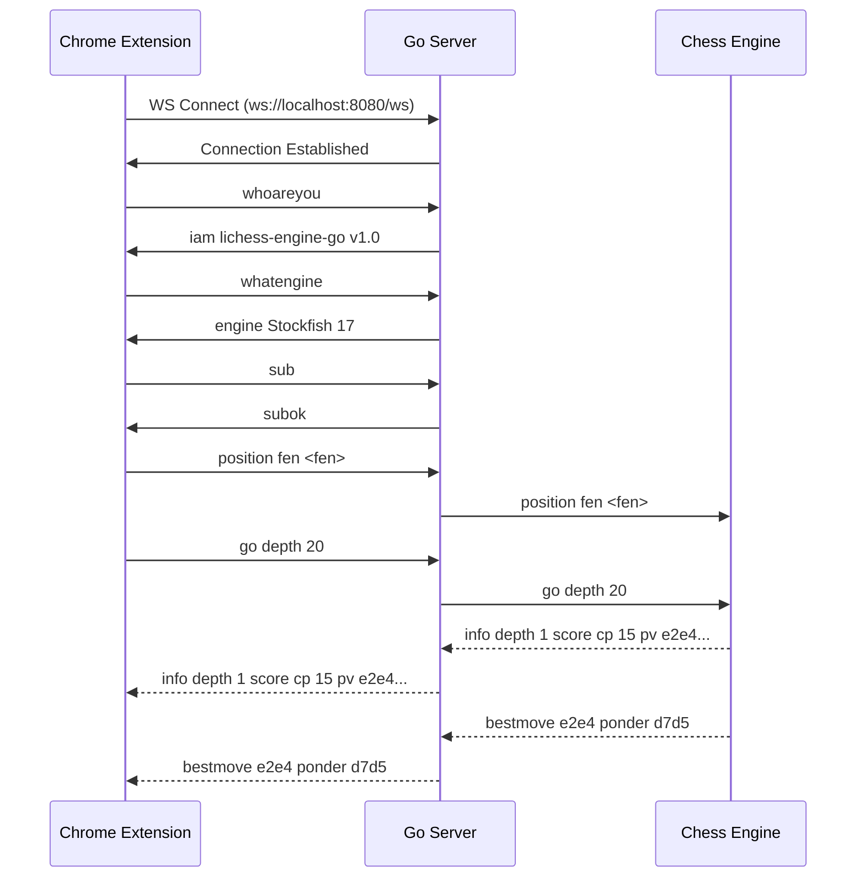

a detailed spec sheet for implementing the Lichess External Engine integration using WebSocket (WSS) in Go.

---

# 🏗️ Architecture Specification Sheet
## Lichess External Engine WebSocket Server in Go

**Project:** Lichess External Engine Integration  
**Version:** 1.0  
**Date:** 2026-01-16  
**Repository:** `reductionfear/bmmbariol`

---

## 1. Executive Summary

This specification describes a Go-based WebSocket server that bridges the Chrome Extension (`/lichessidea`) with the BetterMint engine system (`/EngineWS`). The goal is to rewrite the Python-based engine backend in Go while maintaining full compatibility with the existing client protocol and supporting all engine features.

### 1.1 Core Objectives

| Objective | Description |
|-----------|-------------|
| **Protocol Compatibility** | Maintain chesshook-intermediary WebSocket protocol for seamless extension integration |
| **Multi-Engine Support** | Support Stockfish, Leela Chess Zero, Maia, and Rodent engines with their dependencies |
| **Intelligence Features** | Port the full intelligence system (preferences, multipliers, thresholds) from Python to Go |
| **Secure WebSocket** | Support both `ws://` and `wss://` connections for local and remote deployments |
| **Performance** | Leverage Go's concurrency for faster engine communication and multi-client handling |

---

## 2. System Architecture

### 2.1 High-Level Architecture

```
┌────────────────────────────────────────────────────────────────────────��────────┐
│                              LICHESS. ORG                                        │
└─────────────────────────────────────────────────────────────────────────────────┘
                                     │
                                     ▼
┌─────────────────────────────────────────────────────────────────────────────────┐
│                         CHROME EXTENSION                                         │
│  ┌──────────────┐    ┌───────────────┐    ┌────────────────┐                   │
│  │  inject. js   │◄──►│  content.js   │◄──►│ background.js  │                   │
│  │ (Page DOM)   │    │ (Bridge)      │    │ (WSS Handler)  │                   │
│  └──────────────┘    └───────────────┘    └───────┬────────┘                   │
└─────────────────────────────────────────────────────│───────────────────────────┘
                                                      │ WebSocket (WSS)
                                                      ▼
┌─────────────────────────────────────────────────────────────────────────────────┐
│                         GO WEBSOCKET SERVER                                      │
│  ┌────────────────────────────────────────────────────────────────────────────┐ │
│  │                         CONNECTION MANAGER                                  │ │
│  │  ┌─────────────┐  ┌──────────────┐  ┌─────────────────┐                   │ │
│  │  │ Auth Layer  │  │ Sub/Unsub    │  │ Lock Manager    │                   │ │
│  │  │ (PassKey)   │  │ (Engine Out) │  │ (Write Access)  │                   │ │
│  │  └─────────────┘  └──────────────┘  └─────────────────┘                   │ │
│  └─────────────────────────────────────│──────────────────────────────────────┘ │
│                                        ▼                                         │
│  ┌────────────────────────────────────────────────────────────────────────────┐ │
│  │                         ENGINE MANAGER                                      │ │
│  │  ┌────────────────┐  ┌─────────────────┐  ┌────────────────────┐          │ │
│  │  │ UCI Protocol   │  │ Intelligence    │  │ Multi-Engine       │          │ │
│  │  │ Handler        │  │ System          │  │ Pool               │          │ │
│  │  └────────────────┘  └─────────────────┘  └────────────────────┘          │ │
│  └─────────────────────────────────────│──────────────────────────────────────┘ │
└─────────────────────────────────────────│───────────────────────────────────────┘
                                          ▼
┌─────────────────────────────────────────────────────────────────────────────────┐
│                              CHESS ENGINES                                       │
│  ┌──────────────┐  ┌──────────────┐  ┌──────────────┐  ┌──────────────┐        │
│  │  Stockfish   │  │  Leela (lc0) │  │    Maia      │  │   Rodent     │        │
│  │  + Books     │  │  + Weights   │  │  + Weights   │  │+ Personalities│       │
│  └──────────────┘  └──────────────┘  └──────────────┘  └──────────────┘        │
└─────────────────────────────────────────────────────────────────────────────────┘
```

### 2.2 File Structure (Go Implementation)

```
/lichessidea/externalengineidea/
├── main.go                    # Entry point & HTTP server
├── go.mod
├── go.sum
├── config/
│   ├── config. go              # Configuration management
│   └── settings.json          # Runtime settings
├── server/
│   ├── websocket. go           # WebSocket handler
│   ├── auth.go                # Authentication logic
│   ├── connection.go          # Connection manager
│   └── message.go             # Message parsing/routing
├── engine/
│   ├── manager.go             # Multi-engine pool manager
│   ├── uci.go                 # UCI protocol implementation
│   ├── stockfish.go           # Stockfish-specific handler
│   ├── leela.go               # Leela Chess Zero handler
│   ├── maia.go                # Maia engine handler
│   └── rodent.go              # Rodent engine handler
├── intelligence/
│   ├── settings.go            # Intelligence settings model
│   ├── evaluator.go           # Move evaluation modifier
│   ├── analyzer.go            # Position analysis
│   └── multipliers.go         # Piece/move multipliers
├── models/
│   ├── move.go                # MoveCandidate struct
│   ├── game_state.go          # GameState struct
│   └── analysis.go            # AnalysisSession struct
├── chess/
│   ├── board.go               # Board representation
│   ├── move.go                # Move parsing/validation
│   └── detection.go           # Pin/threat detection
└── utils/
    ├── logger.go              # Logging utilities
    └── helpers.go             # Common helpers
```

---

## 3. WebSocket Protocol Specification

### 3.1 Connection Lifecycle



### 3.2 Protocol Commands

| Command | Direction | Description | Response |
|---------|-----------|-------------|----------|
| `whoareyou` | Client → Server | Identify server | `iam <namespace>v<version>` |
| `whatengine` | Client → Server | Get engine name | `engine <name>` |
| `auth <passkey>` | Client → Server | Authenticate | `authok` / `autherr` |
| `sub` | Client → Server | Subscribe to output | `subok` / `suberr` / `autherr` |
| `unsub` | Client → Server | Unsubscribe | `unsubok` / `unsuberr` |
| `lock` | Client → Server | Lock engine | `lockok` / `lockerr` / `autherr` |
| `unlock` | Client → Server | Unlock engine | `unlockok` / `unlockerr` |
| `<uci command>` | Client → Server | UCI command | Engine output / `autherr` |
| `info ... ` | Server → Client | Engine analysis | (Subscribers only) |
| `bestmove ...` | Server → Client | Best move result | (Subscribers only) |

### 3.3 Authentication Flow

```go
// Authentication configuration
type AuthConfig struct {
    RequireAuthForWrite  bool   // Default: true
    RequireAuthForRead   bool   // Default:  false  
    LocalhostBypass      bool   // Default: true
    PassKey              string // Random 10-char alphanumeric
    MaxFailedAttempts    int    // Default: 3 (then stonewall)
}
```

---

## 4. Engine Integration Specification

### 4.1 Engine Configuration

Based on the `/EngineWS/enginesfilestructure. txt`:

```go
type EngineConfig struct {
    // Core paths (relative to project root)
    EnginesDir      string // ./engines
    BooksDir        string // ./books
    WeightsDir      string // ./weights
    PersonalitiesDir string // ./personalities
    TablesbaseDir   string // ./ctg
    
    // Engine-specific configs
    Stockfish StockfishConfig
    Leela     LeelaConfig
    Maia      MaiaConfig
    Rodent    RodentConfig
}

type StockfishConfig struct {
    Path       string   // ./engines/stockfish/stockfish
    Threads    int      // CPU threads
    Hash       int      // Hash table size (MB)
    MultiPV    int      // Multi-principal variation count
    SyzygyPath string   // Tablebase path
    BookFile   string   // Opening book path
}

type LeelaConfig struct {
    Path        string // ./engines/leela/lc0
    WeightsFile string // ./weights/network. pb. gz
    Threads     int
    Backend     string // "cuda", "cudnn", "cpu", "opencl"
}

type MaiaConfig struct {
    Path             string  // Maia uses lc0 binary
    WeightsFile      string  // ./weights/maia-1900.pb.gz
    NodesPerSecLimit float64 // 0.001 for human-like play
    SlowMover        bool
}

type RodentConfig struct {
    Path         string // ./engines/rodent/rodent
    Personality  string // Personality file name
    PersonalityDir string
}
```

### 4.2 UCI Protocol Handler

```go
// UCIEngine interface for all engines
type UCIEngine interface {
    Start() error
    Stop() error
    IsReady() bool
    
    // UCI commands
    SendCommand(cmd string) error
    SetOption(name, value string) error
    NewGame() error
    SetPosition(fen string, moves []string) error
    Go(params GoParams) error
    Quit() error
    
    // Output handling
    ReadOutput() <-chan string
    GetEngineName() string
}

type GoParams struct {
    Depth       int
    MoveTime    int  // milliseconds
    WTime       int  // White time (ms)
    BTime       int  // Black time (ms)
    WInc        int  // White increment (ms)
    BInc        int  // Black increment (ms)
    Infinite    bool
    Ponder      bool
    SearchMoves []string
}
```

---

## 5. Intelligence System Specification

### 5.1 Intelligence Settings Model

Ported from `/EngineWS/models. py`:

```go
type IntelligenceSettings struct {
    // Master toggle
    IntelligenceEnabled bool `json:"intelligence_enabled"`
    
    // Avoidance control
    AvoidLowIntelligence    bool    `json:"avoid_low_intelligence"`
    LowIntelligenceThreshold float64 `json:"low_intelligence_threshold"` // -3. 0 to -1.0
    
    // Move multipliers
    AggressivenessContempt float64 `json:"aggressiveness_contempt"`
    PassivenessContempt    float64 `json:"passiveness_contempt"`
    TradingPreference      float64 `json:"trading_preference"`
    CapturePreference      float64 `json:"capture_preference"`
    CastlePreference       float64 `json:"castle_preference"`
    EnPassantPreference    float64 `json:"en_passant_preference"`
    PromotionPreference    float64 `json:"promotion_preference"`
    
    // Boolean preferences
    PreferEarlyCastling bool    `json:"prefer_early_castling"`
    PreferPins          bool    `json:"prefer_pins"`
    PreferSideCastle    bool    `json:"prefer_side_castle"`
    CastleSide          *string `json:"castle_side"` // "kingside" or "queenside"
    
    // Piece movement preferences (multipliers)
    PawnPreference   float64 `json:"pawn_preference"`
    KnightPreference float64 `json:"knight_preference"`
    BishopPreference float64 `json:"bishop_preference"`
    RookPreference   float64 `json:"rook_preference"`
    QueenPreference  float64 `json:"queen_preference"`
    KingPreference   float64 `json:"king_preference"`
    
    // Special behaviors
    StayEqual           bool    `json:"stay_equal"`
    StalemateProbability float64 `json:"stalemate_probability"`
    AlwaysPromoteQueen  bool    `json:"always_promote_queen"`
    CheckmateImmediately bool   `json:"checkmate_immediately"`
}
```

### 5.2 Intelligence Evaluation Flow

```go
func (m *IntelligenceManager) ApplyIntelligence(
    candidates []MoveCandidate,
    gameState *GameState,
) []MoveCandidate {
    // 1. Check if intelligence is disabled
    if !m.settings.IntelligenceEnabled {
        return candidates // Return unmodified
    }
    
    // 2. Identify checkmate moves first (set to 1000. 0 absolute)
    for i := range candidates {
        if m.isCheckmate(candidates[i], gameState. Board) {
            candidates[i].ScorePawns = 1000.0
            candidates[i].ScoreCP = 100000
        }
    }
    
    // 3. Apply multipliers to non-mate moves
    for i := range candidates {
        if candidates[i].ScorePawns < 1000.0 {
            candidates[i] = m.applyMultipliers(candidates[i], gameState)
        }
    }
    
    // 4. Apply special behaviors (stalemate, promotion filtering, etc.)
    candidates = m.applySpecialBehaviors(candidates, gameState)
    
    // 5. Sort by modified evaluation
    sort.Slice(candidates, func(i, j int) bool {
        return candidates[i].ScorePawns > candidates[j].ScorePawns
    })
    
    // 6. Check avoidance threshold
    if m. settings.AvoidLowIntelligence {
        threshold := m.settings. LowIntelligenceThreshold
        if candidates[0].ScorePawns <= threshold {
            // Revert to original engine move
            return m.getOriginalCandidates()
        }
    }
    
    return candidates
}
```

### 5.3 Multiplier Application

```go
func (m *IntelligenceManager) applyMultipliers(
    candidate MoveCandidate,
    gameState *GameState,
) MoveCandidate {
    board := gameState.Board
    move := candidate.Move
    
    totalMultiplier := 1.0
    isCritical := m.isCriticalPosition(board)
    
    // Piece preferences
    pieceMultipliers := map[chess.PieceType]float64{
        chess. Pawn:   m.settings.PawnPreference,
        chess.Knight: m.settings.KnightPreference,
        chess.Bishop: m.settings.BishopPreference,
        chess. Rook:   m.settings.RookPreference,
        chess.Queen:  m.settings. QueenPreference,
        chess.King:   m.settings.KingPreference,
    }
    
    piece := board.PieceAt(move.From)
    if mult, ok := pieceMultipliers[piece. Type()]; ok && mult != 1.0 {
        totalMultiplier *= mult
    }
    
    // Move characteristic multipliers
    if board.IsCapture(move) {
        totalMultiplier *= m.settings.CapturePreference
    }
    if board.IsCastling(move) {
        totalMultiplier *= m.settings. CastlePreference
    }
    // ... additional multipliers
    
    // Apply with critical position protection
    newEval := m.applyChessMultiplier(
        candidate.ScorePawns,
        totalMultiplier,
        isCritical,
    )
    
    candidate.ScorePawns = newEval
    candidate.ScoreCP = int(newEval * 100)
    candidate.IntelligenceModified = true
    candidate.IntelligenceMultiplier = totalMultiplier
    
    return candidate
}

func (m *IntelligenceManager) applyChessMultiplier(
    eval, multiplier float64,
    isCritical bool,
) float64 {
    if multiplier == 1.0 || eval == 0.0 {
        return eval
    }
    
    // Reduce effect in critical positions
    if isCritical {
        if multiplier > 1.0 {
            multiplier = 1.0 + (multiplier-1.0)*0.3
        } else {
            multiplier = 1.0 - (1.0-multiplier)*0.3
        }
    }
    
    // Handle sign correctly
    if eval > 0 {
        return eval * multiplier
    }
    return eval / multiplier
}
```

---

## 6. Data Models

### 6.1 MoveCandidate

```go
type MoveCandidate struct {
    Move       string  `json:"move"`       // UCI format (e.g., "e2e4")
    FromSquare string  `json:"from_square"`
    ToSquare   string  `json:"to_square"`
    ScoreCP    int     `json:"score_cp"`    // Centipawns
    ScorePawns float64 `json:"score_pawns"`
    Depth      int     `json:"depth"`
    MateIn     *int    `json:"mate_in,omitempty"`
    PVLine     []string `json:"pv_line"`
    Nodes      int64   `json:"nodes"`
    
    // Move characteristics
    IsAggressive  bool `json:"is_aggressive"`
    IsPassive     bool `json:"is_passive"`
    IsTactical    bool `json:"is_tactical"`
    IsPositional  bool `json:"is_positional"`
    IsCapture     bool `json:"is_capture"`
    IsCheck       bool `json:"is_check"`
    IsBookMove    bool `json:"is_book_move"`
    IsCastling    bool `json:"is_castling"`
    IsEnPassant   bool `json:"is_en_passant"`
    IsPromotion   bool `json:"is_promotion"`
    CreatesPin    bool `json:"creates_pin"`
    IsTrade       bool `json:"is_trade"`
    TradeValue    float64 `json:"trade_value"`
    
    // Intelligence tracking
    OriginalScorePawns     float64 `json:"original_score_pawns"`
    IntelligenceModified   bool    `json:"intelligence_modified"`
    IntelligenceMultiplier float64 `json:"intelligence_multiplier"`
    
    // Quality assessment
    QualityScore float64 `json:"quality_score"` // 0-100
    QualityLabel string  `json:"quality_label"`
}
```

### 6.2 GameState

```go
type GameState struct {
    // Board state
    CurrentFEN      string   `json:"current_fen"`
    PositionHistory []string `json:"position_history"`
    
    // Game info
    MoveNumber int    `json:"move_number"`
    Turn       string `json:"turn"` // "w" or "b"
    GamePhase  string `json:"game_phase"` // "opening", "middlegame", "endgame"
    PieceCount int    `json:"piece_count"`
    
    // Game status
    IsCheck     bool   `json:"is_check"`
    IsCheckmate bool   `json:"is_checkmate"`
    IsStalemate bool   `json:"is_stalemate"`
    IsDraw      bool   `json:"is_draw"`
    GameResult  string `json:"game_result"` // "*", "1-0", "0-1", "1/2-1/2"
    
    // Analysis
    CurrentEvaluation float64   `json:"current_evaluation"`
    EvaluationHistory []float64 `json:"evaluation_history"`
    LastMove          string    `json:"last_move"`
    
    // Opening tracking
    OpeningName    string `json:"opening_name"`
    MovesFromBook  int    `json:"moves_from_book"`
    StillInBook    bool   `json:"still_in_book"`
    
    // Intelligence tracking
    IntelligenceActive         bool    `json:"intelligence_active"`
    LastIntelligenceDecision   string  `json:"last_intelligence_decision"`
    IntelligenceAvoidedCount   int     `json:"intelligence_avoided_count"`
    IntelligenceUsageRate      float64 `json:"intelligence_usage_rate"`
}
```

---

## 7. API Endpoints (Optional REST Interface)

In addition to WebSocket, provide REST API for configuration:

| Endpoint | Method | Description |
|----------|--------|-------------|
| `/api/status` | GET | Server/engine status |
| `/api/engines` | GET | List available engines |
| `/api/engines/{id}` | POST | Select active engine |
| `/api/settings` | GET | Get current settings |
| `/api/settings` | POST | Update settings |
| `/api/intelligence` | GET | Intelligence statistics |
| `/api/intelligence` | POST | Update intelligence settings |
| `/ws` | WS | WebSocket endpoint |

---

## 8. Build & Deployment

### 8.1 Go Module Dependencies

```go
// go.mod
module github.com/reductionfear/bmmbariol/lichessidea/externalengineidea

go 1.21

require (
    github.com/gorilla/websocket v1.5.1
    github.com/notnil/chess v1.9.0      // Chess move validation
    github.com/spf13/viper v1.18.0      // Configuration
    go.uber.org/zap v1.26.0             // Logging
)
```

### 8.2 Build Commands

```bash
# Development
go run main.go -addr localhost:8080 -engine ./stockfish

# Production build
go build -o lichess-engine-server main.go

# Cross-compile for Windows
GOOS=windows GOARCH=amd64 go build -o lichess-engine-server. exe main.go

# With TLS (WSS)
./lichess-engine-server -addr : 8443 -tls -cert server.crt -key server.key
```

### 8.3 Command Line Flags

```go
var (
    addr            = flag.String("addr", "localhost:8080", "HTTP service address")
    engine          = flag.String("engine", "./stockfish", "Engine binary path")
    uciArgs         = flag.String("uciargs", "", "UCI init commands (semicolon-separated)")
    authWrite       = flag.Bool("authwrite", true, "Require auth for writes")
    authRead        = flag.Bool("authread", false, "Require auth for reads")
    localBypass     = flag. Bool("localhost", true, "Bypass auth for localhost")
    tls             = flag. Bool("tls", false, "Enable TLS/WSS")
    certFile        = flag. String("cert", "", "TLS certificate file")
    keyFile         = flag.String("key", "", "TLS private key file")
    configFile      = flag. String("config", "", "Configuration JSON file")
    multiPV         = flag.Int("multipv", 3, "Multi-PV count for analysis")
    intelligence    = flag.Bool("intelligence", false, "Enable intelligence system")
)
```

---

## 9. Testing Strategy

### 9.1 Unit Tests

```go
// engine/uci_test.go
func TestUCIProtocol(t *testing.T) {
    engine := NewStockfishEngine("./stockfish")
    err := engine.Start()
    assert.NoError(t, err)
    
    assert.True(t, engine.IsReady())
    assert.Contains(t, engine. GetEngineName(), "Stockfish")
    
    engine.SetPosition("rnbqkbnr/pppppppp/8/8/8/8/PPPPPPPP/RNBQKBNR w KQkq - 0 1", nil)
    engine.Go(GoParams{Depth:  10})
    
    output := <-engine.ReadOutput()
    assert.Contains(t, output, "bestmove")
}

// intelligence/evaluator_test.go
func TestMultiplierApplication(t *testing. T) {
    settings := &IntelligenceSettings{
        IntelligenceEnabled:  true,
        CapturePreference:  1.5,
    }
    
    manager := NewIntelligenceManager(settings)
    
    candidate := MoveCandidate{
        Move:  "e4d5",
        ScorePawns:  0.5,
        IsCapture: true,
    }
    
    result := manager.applyMultipliers(candidate, gameState)
    assert.Equal(t, 0.75, result.ScorePawns) // 0.5 * 1.5
}
```

### 9.2 Integration Tests

```go
func TestWebSocketProtocol(t *testing.T) {
    server := StartTestServer()
    defer server.Close()
    
    conn, _, _ := websocket. DefaultDialer. Dial(server.URL+"/ws", nil)
    defer conn. Close()
    
    // Test whoareyou
    conn.WriteMessage(websocket.TextMessage, []byte("whoareyou"))
    _, msg, _ := conn. ReadMessage()
    assert.Contains(t, string(msg), "iam lichess-engine-go")
    
    // Test subscription
    conn.WriteMessage(websocket. TextMessage, []byte("sub"))
    _, msg, _ = conn.ReadMessage()
    assert.Equal(t, "subok", string(msg))
    
    // Test UCI command
    conn.WriteMessage(websocket. TextMessage, []byte("position startpos"))
    conn.WriteMessage(websocket.TextMessage, []byte("go depth 5"))
    
    // Should receive info lines then bestmove
    for {
        _, msg, _ = conn.ReadMessage()
        if strings. HasPrefix(string(msg), "bestmove") {
            break
        }
    }
}
```

---

## 10. Security Considerations

| Concern | Mitigation |
|---------|------------|
| **Unauthorized Access** | Random passkey generated on startup; 3-attempt lockout |
| **Localhost Bypass** | Only for `127.0.0.1` and `::1` by default |
| **WSS for Remote** | TLS support for secure remote connections |
| **Engine Injection** | Validate engine paths; no shell execution |
| **Rate Limiting** | Max connections per IP; command rate limiting |

---

## 11. Migration Checklist

- [ ] Implement base WebSocket server with gorilla/websocket
- [ ] Port authentication system from existing `main.go`
- [ ] Implement UCI protocol handler
- [ ] Add Stockfish engine support
- [ ] Add Leela Chess Zero support with weight file handling
- [ ] Add Maia engine support with human-like timing
- [ ] Add Rodent engine support with personalities
- [ ] Port intelligence settings model from Python
- [ ] Implement multiplier application logic
- [ ] Implement special behaviors (checkmate boost, stalemate, etc.)
- [ ] Add opening book integration
- [ ] Add Syzygy tablebase support
- [ ] Create REST API for configuration
- [ ] Add TLS/WSS support
- [ ] Write unit and integration tests
- [ ] Create Docker deployment option
- [ ] Update Chrome extension to support new server

---

## 12. Version Roadmap

| Version | Features |
|---------|----------|
| **v1.0** | Core WebSocket server, Stockfish support, basic protocol |
| **v1.1** | Multi-engine support (Leela, Maia, Rodent) |
| **v1.2** | Full intelligence system port |
| **v1.3** | Opening books and tablebases |
| **v2.0** | Remote deployment with WSS, cloud hosting support |

---

This specification provides a complete blueprint for reimplementing the `/EngineWS` Python backend in Go while maintaining full compatibility with the `/lichessidea` Chrome extension via the chesshook-intermediary WebSocket protocol. 
